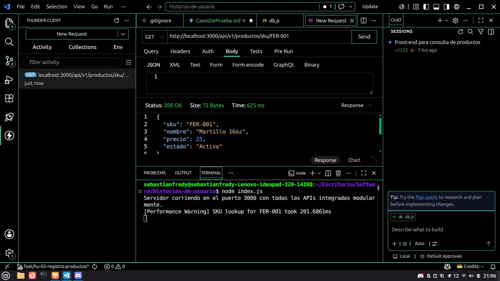
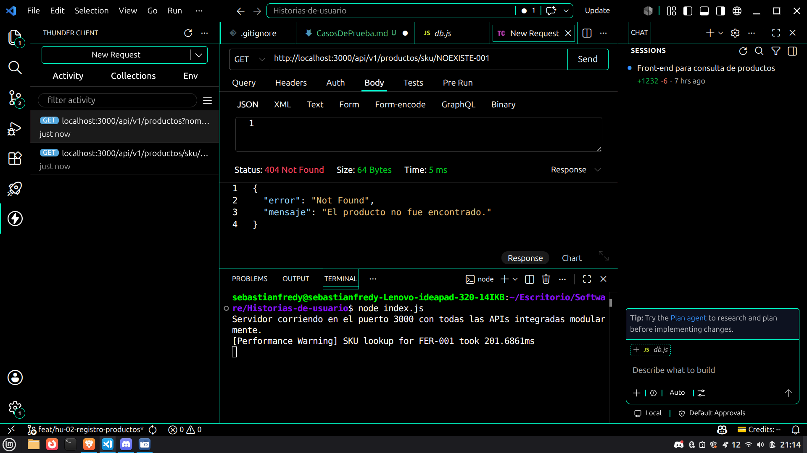
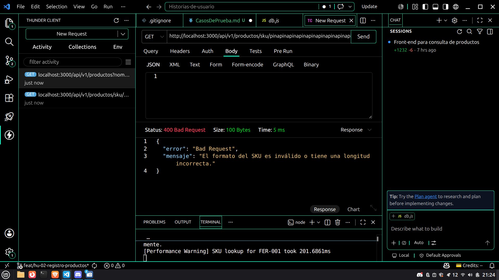
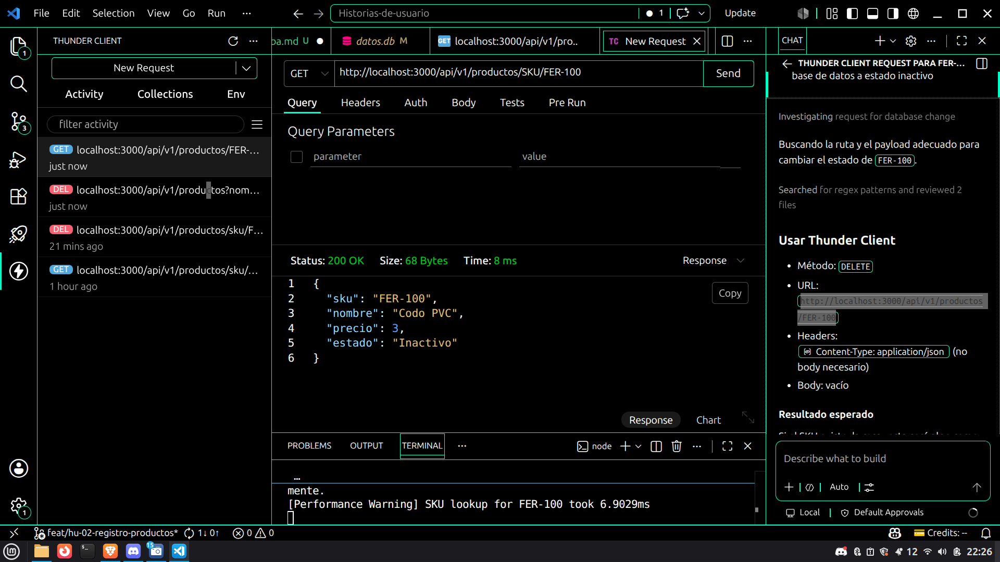
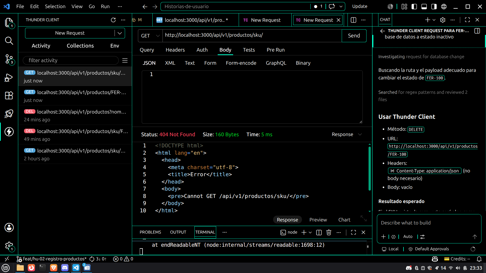

# Casos de Prueba – US-02 (Consultar precio de producto por SKU)
 
| ID    | Qué se debe hacer (acción / entrada) | Salida esperada |
|-------|--------------------------------------|-----------------|
| CP-01 | **CA1 - Consulta Exitosa:** Enviar petición GET al endpoint `/api/v1/productos/sku/FER-001` con un SKU existente y activo. | Código HTTP 200 OK. JSON con la información del producto incluyendo SKU, nombre, precio y estado.   |
| CP-02 | **CA2 - Producto No Encontrado:** Enviar petición GET al endpoint `/api/v1/productos/sku/NOEXISTE-001` con un SKU que no existe en la base de datos. | Código HTTP 404 Not Found indicando mediante un mensaje JSON que el producto no fue encontrado.   |
| CP-03 | **CA3 - Validación de Formato (Caracteres no permitidos):** Enviar petición GET al endpoint `/api/v1/productos/sku/##@` enviando un SKU con caracteres especiales inválidos. | Código HTTP 400 Bad Request. JSON especificando el error de validación por formato o longitud incorrecta.   |
| CP-04 | **CA4 - Consulta de Producto Inactivo:** Enviar petición GET al endpoint `/api/v1/productos/sku/FER-100` correspondiente a un producto registrado pero con estado inactivo. | Código HTTP 200 OK. JSON mostrando la información del producto y reflejando su estado actual ("Inactivo").   |
| CP-05 | **Prueba Extra - SKU Vacío / Ruta Incompleta:** Enviar petición GET al endpoint `/api/v1/productos/sku/` sin especificar ningún parámetro de búsqueda. | Código HTTP 404 Not Found (HTML por defecto del framework) debido a que la ruta sin parámetro no existe.   |
