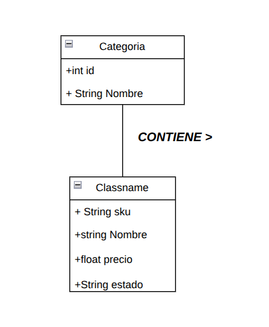
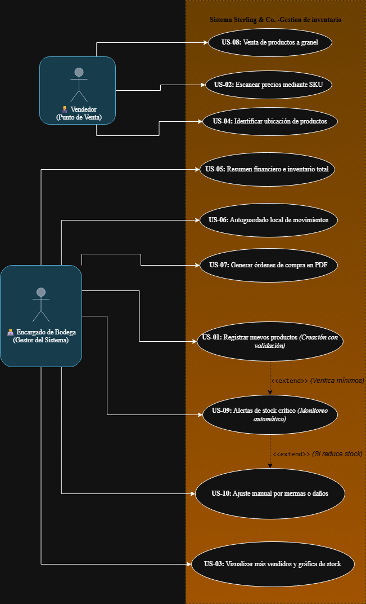
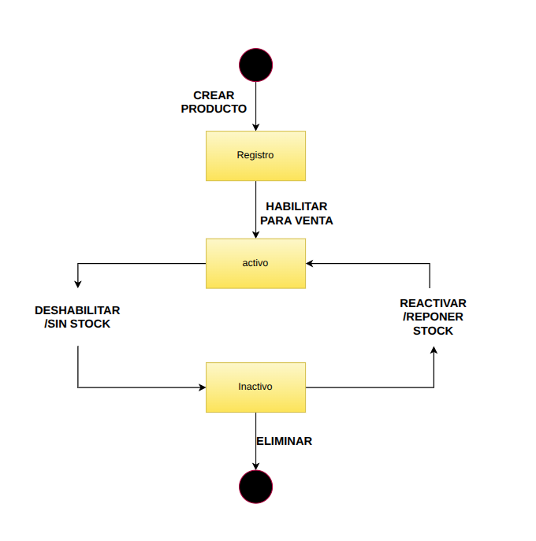
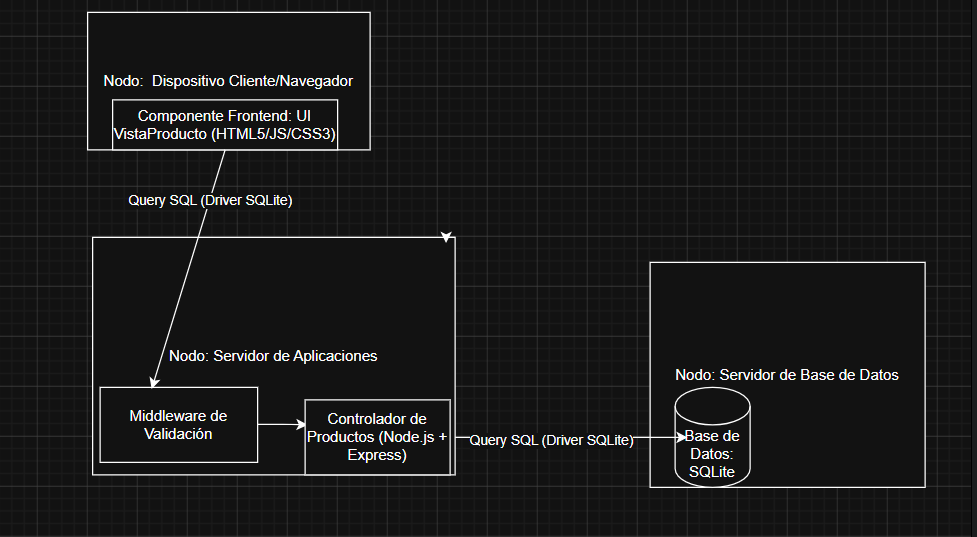
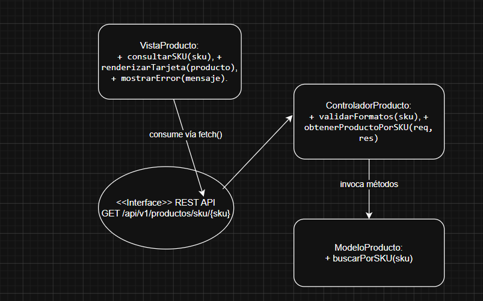
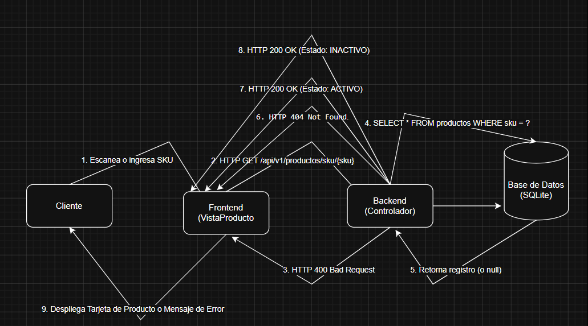

# Sterling & Co.

## Descripción del sistema
**Problemática:** Nuestro proyecto se enfoca en la gestión de inventario de una empresa ficticia Sterling & Co. El objetivo principal es implementar una base de datos que permita la trazabilidad de productos, el control de stock mediante niveles mínimos, la generación de alertas automáticas cuando se alcancen niveles críticos de inventario y el registro contable de las ventas.

**Características Funcionales:**
* Gestión de productos: Registro con códigos SKU únicos.
* Escaneo de precios: Consulta mediante códigos SKU.
* Reportes y gráficas: Visualización de productos más vendidos.
* Ubicación de productos: Identificación rápida en tienda.
* Resumen financiero: Cálculo de ingresos y valor del inventario.
* Autoguardado local: Respaldo automático de movimientos.
* Órdenes de compra: Creación de PDFs ante falta de stock.
* Venta a granel: Soporte para venta por peso.
* Alertas de stock crítico: Notificaciones automáticas.

## Historias de Usuario
Todas las historias están registradas como GitHub Issues.

| ID | Nombre | Issue |
|---|---|---|
| US-01 | Registrar nuevos productos en el inventario | [Issue #1](https://github.com/Zenyth-Team/Historias-de-usuario/issues/1) |
| US-02 | Escanear precios mediante SKU | [Issue #2](https://github.com/Zenyth-Team/Historias-de-usuario/issues/2) |
| US-03 | Visualizar productos más vendidos y gráfica de stock | [Issue #3](https://github.com/Zenyth-Team/Historias-de-usuario/issues/3) |
| US-04 | Identificar ubicación de productos en tienda | [Issue #4](https://github.com/Zenyth-Team/Historias-de-usuario/issues/4) |
| US-05 | Resumen financiero y valor total del inventario | [Issue #5](https://github.com/Zenyth-Team/Historias-de-usuario/issues/5) |
| US-06 | Autoguardado local de inventario y movimientos | [Issue #6](https://github.com/Zenyth-Team/Historias-de-usuario/issues/6) |
| US-07 | Generación automática de órdenes de compra en PDF | [Issue #7](https://github.com/Zenyth-Team/Historias-de-usuario/issues/7) |
| US-08 | Venta de productos a granel | [Issue #8](https://github.com/Zenyth-Team/Historias-de-usuario/issues/8) |
| US-09 | Alertas automáticas de stock crítico | [Issue #9](https://github.com/Zenyth-Team/Historias-de-usuario/issues/9) |
| US-10 | Ajuste manual de inventario por mermas o daños | [Issue #10](https://github.com/Zenyth-Team/Historias-de-usuario/issues/10) |

## Requisitos Extrafuncionales
Ver catálogo detallado en: [ReqExtrafuncionales.md](./ReqExtrafuncionales.md)

## Entidades del Dominio
El sistema gestiona la persistencia de datos mediante las siguientes entidades principales y sus atributos:
* **Producto:** SKU, nombre, descripción, precio, cantidad_stock, stock_minimo, seccion_id.
* **Sección:** ID, nombre_seccion, descripción de ubicación.
* **Venta:** ID, fecha_hora, total_venta, metodo_pago.
* **DetalleVenta:** venta_id, producto_id, cantidad_vendida, subtotal.
* **Movimiento/Merma:** ID, producto_id, cantidad, tipo_movimiento, motivo, fecha.
* **Proveedor:** ID, nombre_empresa, contacto, categoría_productos.

## Mockups
A continuación se presentan los prototipos de baja fidelidad del sistema:
Enlace a Figma: https://carry-pack-20330348.figma.site/

| Mockup / Pantalla | Historia de usuario relacionada |
|---|---|
| [Ver vista de Registro de Producto](pngs/US-01.png) | US-01 |
| [Ver vista de Escáner de Precios](pngs/US-02.png) | US-02 |
| [Ver vista de Dashboard y Gráficas](pngs/US-003.png) | US-03 |
| [Ver vista de Ubicación en Tienda](pngs/US-04.png) | US-04 |
| [Ver vista de Resumen Financiero](pngs/US-05.png) | US-05 |
| [Ver vista de Autoguardado](pngs/US-06.png) | US-06 |
| [Ver vista de Órdenes de Compra](pngs/US-07.png) | US-07 |
| [Ver vista de Venta a Granel](pngs/US-08.png) | US-08 |
| [Ver vista de Alertas de Stock](pngs/US-09.png) | US-09 |
| [Ver vista de Ajuste por Mermas](pngs/US-10.png) | US-10 |

## Diseño Arquitectónico
Ver detalle de arquitectura y decisiones de diseño en: [arquitectura.md](./arquitectura.md)


## Artefactos del proyecto
| Artefacto                          | Ubicación / enlace          |
|------------------------------------|-----------------------------|
| Modelo de dominio                  |  |
| Diagrama de casos de uso           |  |
| Especificación de HU               | [Especificación de Historias de Usuario](./EspecificacionHU.md)  |
| Diagrama de estados                |  |
| Diagrama de despliegue y comp.     |  |
| Diagrama de componentes            |  |
| Diagrama de secuencia              |  |
| Casos de prueba                    | [Casos de prueba](./Casosdeprueba.md) |
| Deuda técnica / code smells        | [Deuda técnica / code smells](./DeudaTecnica.md)  |


## Instrucciones de instalacion y ejecucion

### Requisitos previos
- Node.js 20 o superior para ejecucion local.
- Docker Desktop con Docker Compose para ejecucion con contenedores.
- Puerto `3000` disponible para la API.
- Puerto `8080` disponible para la interfaz web en Docker.

### Variables de entorno
| Variable | Descripcion | Valor por defecto |
|----------|-------------|-------------------|
| `PORT` | Puerto interno usado por Express | `3000` |
| `NODE_ENV` | Ambiente de ejecucion de Node.js | `production` en Docker |

### Instalacion y ejecucion sin Docker
```bash
npm install
npm start
```

Luego abrir:
- API / Swagger: `http://localhost:3000/api-docs`
- Healthcheck: `http://localhost:3000/health`
- Interfaz local: abrir `buscar-producto.html` en el navegador.

### Instalacion y ejecucion con Docker
La implementacion Docker separa la aplicacion en dos capas:
- `api-ferreteria`: backend Express + SQLite, expuesto en `http://localhost:3000`.
- `web-ferreteria`: frontend HTML servido por Nginx, expuesto en `http://localhost:8080`.

```bash
docker compose up -d --build
```

Verificar contenedores:
```bash
docker compose ps
```

Ver logs del backend:
```bash
docker logs api-ferreteria
```

Detener la aplicacion:
```bash
docker compose down
```

### Bonus de contenedores
- Contenedores: si, archivo `docker-compose.yml` funcional con separacion por capas en dos contenedores.
- Backend: Express + SQLite.
- Frontend: Nginx sirviendo `buscar-producto.html`.

## Responsabilidades del equipo
| Integrante | Rol(es) | Ítems de la rúbrica a cargo |
|------------|---------|-----------------------------|
| Ignacio Jorquera | Scrum Master | 2.1 Modelo de dominio, 2.2 Casos de uso, 2.3 Especificación de HU, 2.4 Diagrama de estados, y Demostración de la HU. |
| Matias Horvath  | Arquitecto | 3.1 Despliegue y comp., 3.2 Componentes (Interfaces), 3.3 Diagrama de secuencia, y Explicación de la arquitectura. |
| David Daniel Nuñez Ruiz | Developer | 1.1 HU completa (Desarrollo), 1.2 Instalación y ejecución, y Explicación del código. |
| Graham | Technical Lead y Quality Assurance | 4.1 Casos de prueba, Demostración de pruebas en el sistema y Deuda técnica / code smells. |
| Diego Marengo | Technical Lead | 1.3 GitHub workflow (Ramas y PRs) y Presentación del repositorio. |

