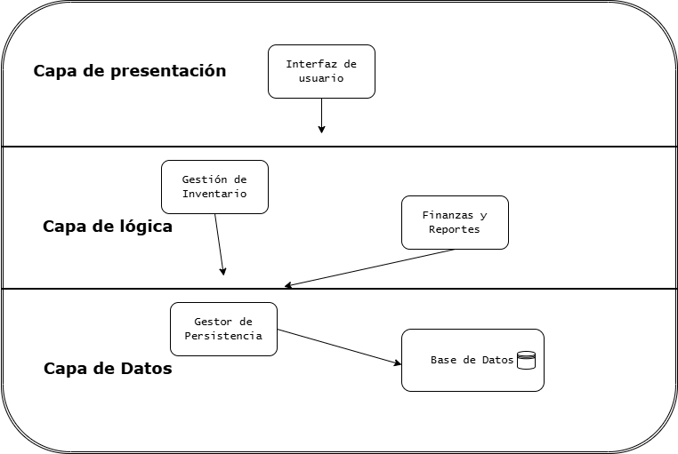

## 1. Estilo Arquitectónico

Estilo adoptado: **Arquitectura Monolítica en Capas (Layered Architecture)**

Justificación basada en REF priorizados:

| REF ID | Descripción | Prioridad | Cómo lo aborda el estilo |
|---|---|---|---|
| REF-01 | Respuesta de escaneo < 1 segundo | Alta | La separación de la capa de presentación permite que el frontend procese interacciones inmediatas (JS) y solo pida datos puntuales al backend, reduciendo la latencia. |
| REF-02 | Operación local (Alta disponibilidad) | Alta | Al ser un monolito ejecutado localmente, tanto el frontend, backend y la base de datos conviven en el mismo entorno, eliminando la dependencia de red externa. |
| REF-03 | Uso obligatorio de SQLite | Alta | La arquitectura en capas permite tener una capa de acceso a datos (Data Access) dedicada exclusivamente a gestionar las transacciones con el archivo local SQLite de forma segura. |
| REF-04 | Autoguardado persistente | Alta | El backend monolítico mantiene una conexión directa y constante con la base de datos local, permitiendo escribir cambios en tiempo real sin riesgo de interrupciones de red. |

**Explicación textual:** Se optó por una arquitectura monolítica en capas porque es la estructura que mejor responde a la necesidad de un sistema de ejecución local, altamente disponible y con una base de datos embebida (SQLite). Al dividir lógicamente el sistema en Presentación (HTML/JS), Lógica de Negocio (Flask/Python) y Datos (SQLite), logramos un bajo acoplamiento y alta cohesión. Ningún REF de alta prioridad queda descubierto, ya que la comunicación directa y local entre capas garantiza la velocidad y la persistencia de datos solicitada para la ferretería.

## 2. Diagrama de Arquitectura

## 3. Descomposición Modular

Fundamentación: **Por capa lógica y separación de responsabilidades de dominio (Inventario vs. Finanzas).**

### Módulo 1: Interfaz de Usuario (Capa de Presentación)
* **Responsabilidad:** Renderizar las vistas HTML/CSS, capturar la interacción del usuario (escaneo de SKU, clicks en reportes) y validar datos de entrada de manera preliminar.
* **Ofrece a otros módulos:** Peticiones HTTP (GET/POST) estructuradas hacia el backend.
* **Depende de:** Consumir las APIs o rutas expuestas por la Capa de Lógica de Negocio.

### Módulo 2: Gestión de Inventario (Capa de Lógica de Negocio)
* **Responsabilidad:** Centralizar las reglas de negocio sobre los productos: crear nuevos SKU, descontar stock por ventas o mermas, y evaluar los umbrales para lanzar alertas de stock crítico.
* **Ofrece a otros módulos:** Respuestas JSON con la información de productos para la Interfaz, y notificaciones de stock.
* **Depende de:** Capa de Datos (para persistir/leer el stock real).

### Módulo 3: Finanzas y Reportes (Capa de Lógica de Negocio)
* **Responsabilidad:** Procesar cálculos sobre los datos crudos, generar reportes de productos más vendidos, valorización total del inventario y creación de las órdenes de compra en PDF.
* **Ofrece a otros módulos:** Archivos PDF generados y estructuras de datos formateadas para los gráficos del dashboard.
* **Depende de:** Capa de Datos (solo para lectura histórica).

### Módulo 4: Gestor de Persistencia (Capa de Datos)
* **Responsabilidad:** Manejar la conexión exclusiva con el archivo SQLite. Ejecutar las consultas SQL (SELECT, INSERT, UPDATE) aislando al resto del sistema de la sintaxis de la base de datos. Garantizar el autoguardado local.
* **Ofrece a otros módulos:** Métodos abstractos de acceso a datos (ej. `get_producto(sku)`, `save_venta()`).
* **Depende de:** Archivo físico del sistema operativo (SQLite).

## 4. Decisiones de Diseño

### Decisión 1
* **Decisión:** Separar la lógica de "Gestión de Inventario" de la lógica de "Finanzas y Reportes" en dos módulos distintos dentro del backend.
* **Motivación:** Mantener el principio de Responsabilidad Única (SRP). Los requerimientos de reportes y PDFs (US-05, US-07) requieren librerías y procesamiento distintos a las operaciones rápidas y constantes de escaneo (US-02, REF-01).
* **Alternativas consideradas:** Tener un solo gran "Módulo Controlador" que manejara tanto las ventas como los reportes.
* **Impacto:** Facilita la mantenibilidad futura (REF-07) y asegura que los cálculos pesados de los gráficos no ralenticen el escaneo inmediato de productos. Afecta positivamente a ambos módulos.

### Decisión 2
* **Decisión:** Implementar validación cruzada para el Autoguardado (Frontend + Backend local).
* **Motivación:** Garantizar que no se pierdan datos (REF-04). Al no tener una base de datos en la nube, cualquier cierre abrupto de la ventana del navegador podría perder la última venta.
* **Alternativas consideradas:** Guardar todo temporalmente en la memoria del navegador (LocalStorage) y luego pasarlo al backend.
* **Impacto:** Se decide que cada transacción (venta, merma) se envíe de manera sincrónica al Gestor de Persistencia antes de mostrar éxito en la pantalla. Esto impacta el diseño del flujo del Módulo de Interfaz.
